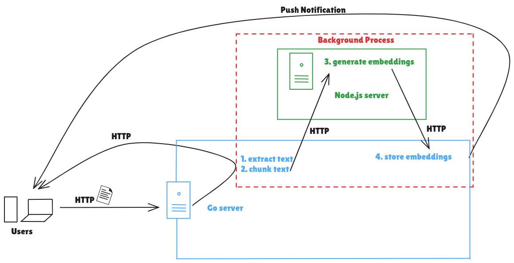

# sally

sally is a RAG application, basically.

I built this application as a response to a question from a WhatsApp group. A groupie asked for recommendations to solve the issue he had:

```txt
When a user uploads a document, I parse and embed the file so that the
LLM can have the same information in the file.

After uploading the file, the embedding process is queued in a background
task, and when it is done, it updates a database table row with the status
of the task - success, processing or failed.

I created another endpoint that the frontend polls for the status of the 
embedding process task.

I feel that this is not very necessary and this process is not optimal.
Is there a better way to do this?
```

The content of this repository is my solution to the challenge, using approximately the same constraints as my groupie that's related to his setup. He used Go and that's why I used Go too. I wasn't interested n installing the bindings for embedding with Go, so I used a Node.js server for embedding. Lastly, since this is a demo of the architechture, I did not invest in a production-grade vector store. I used the local vector store provided by Genkit-Go.

## Setup/Tool Requirements

- Go - for the main server
- Node.js - for the text embedding server
- Asynq + Redis (Docker) - for background processing
- Web Push Notifications

## How to set up

You need to have the following installed on your computer:

- Docker
- Node.js
- Go

Procedure:

- Run `make init` to install projects dependencies
- Run `make serve`
- Create a `.env` file in `server/`.
- [Generate VAPID keys](https://github.com/SherClockHolmes/webpush-go#generating-vapid-keys) only once and include them in `.env` using the format in `.env.template`
- In the `client` directory, run `live-server` or any other file server you have to serve the frontend.

## Architecture



Users send their document via HTTP to the Go server, which saves it first and responds to the user immediately (to end the HTTP req-res cycle). A background process is started using asynq to start the embedding process which involves:

1. extracting the text from the document
2. chunking the text
3. generating embeddings
4. storing the embeddings

Steps 1, 2 and 4 are done in Go. Text chunks are sent to the Node.js server via HTTP to generate embeddings and embeddings are stored using Genkit-Go's local vector store.

When the processing is complete in the background, the user is sent a push notification to notify them and they can now search the document.

## Video Demo


## Caveats

This project is not production-grade. It was built to show that this was a possible solution to the challenge. You can also use emails to solve this issue.
